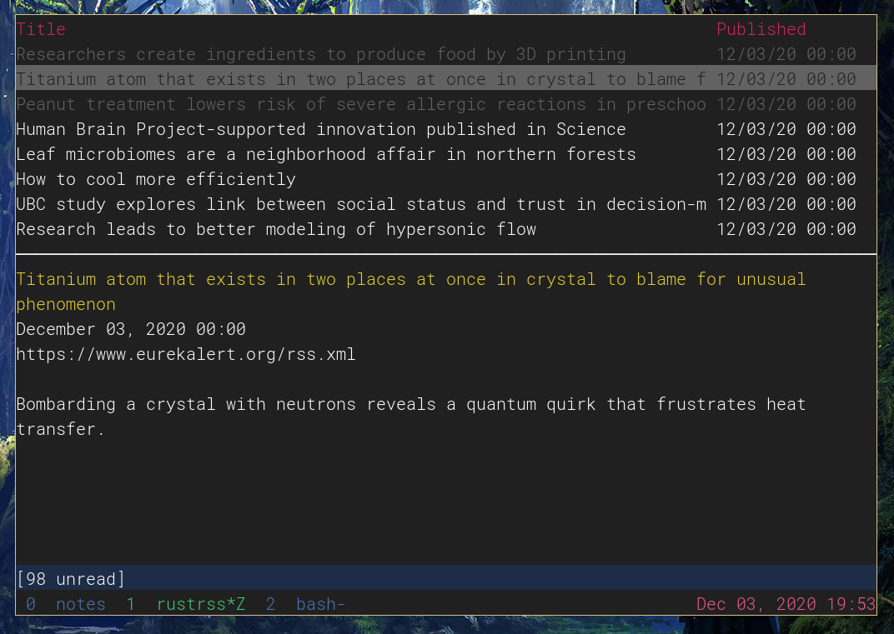

# rssrs

Terminal RSS reader

## feeds.txt
Each feed is a `url`, `title`, and list comma-separated `tags`, separated by `|`s, e.g:
```
https://hnrss.org/frontpage | Hacker News | tech,news
```

## TODO

- view to select filter(s)
    - space to mark filters
    - filter: tag (0+)
        - T to show tag selection
    - filter: channel (0+)
        - C to show channel selection
- load config from file
    - keyword filters


